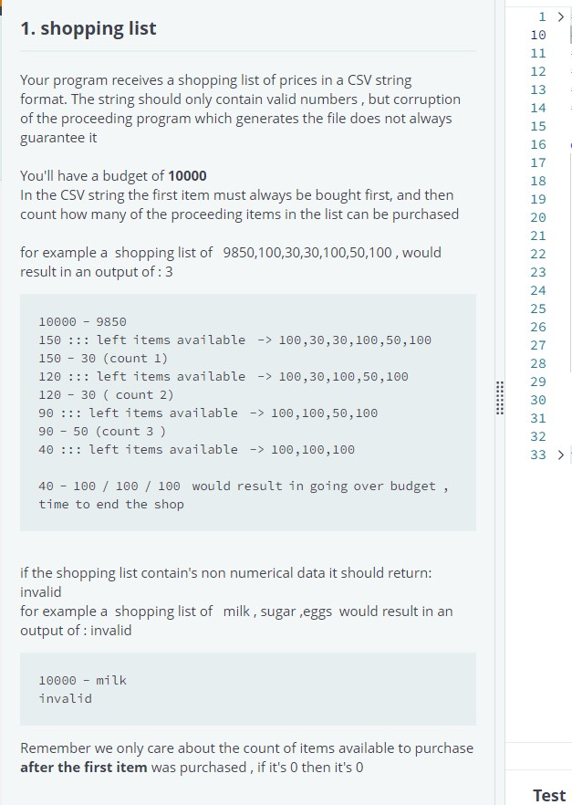
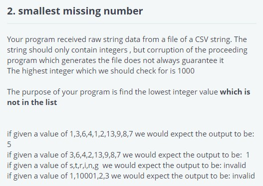

# python

#Error:
root@bhoobalan_pc:~# pip download audio-metadata
Collecting audio-metadata
  Could not find a version that satisfies the requirement audio-metadata (from versions: )
No matching distribution found for audio-metadata

#Download package

#Install from local package

pip3 install ./audio-metadata-0.11.1.tar.gz

## Problem Solving

# EC2 instance tag list and filter
## this one is using load json, filter based on tags, accessing dictionary objects

